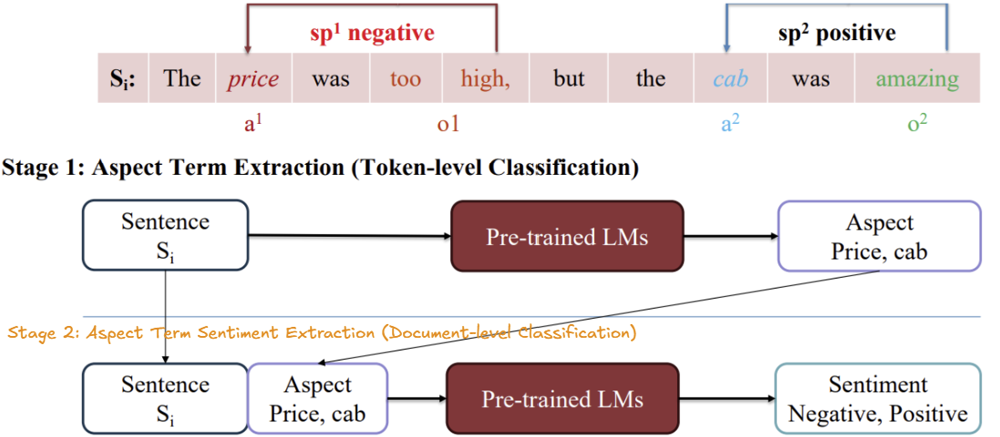

## Aspect-based Sentiment Analysis
Aspect-Based Sentiment Analysis (ABSA) is a task with many applications today in analyzing different aspects of comments and reviews about products, services, etc. An illustrative example is shown in Figure 1, with the input sentence: "The price was too high, but the cab was amazing.". In this sentence, there are two aspects being evaluated: "price" and "cab". The aspect "price" is evaluated as "too high", thus it is "negative", and the aspect "cab" is [evaluated/described; 'described' is slighty better because amazing describes, 'evaluated' implies a formal process] as "amazing", therefore it is "positive".

Based on defining the output values of the model, we can have several smaller subtasks as follows:

1. **Aspect Term Extraction (ATE)** or Aspect-Based Term Extraction: Extract the aspects that are evaluated in the comment.

2. **Aspect Term Sentiment Classification (ATSC)**: Given the input sentence and the aspects evaluated in the comment, predict the sentiment of the comment towards those aspects. (Added "towards those aspects" for clarity).

3. **Aspect Sentiment Pair Extraction (ASPE)**: Given the input sentence, extract the aspects and predict the sentiment associated with each aspect. (Added "associated with each aspect" for better clarity).

4. **Aspect-Oriented Opinion Extraction (AOOE)**, also known as **Targeted Opinion Word Extraction (TOWE)**, or **Opinion Target Extraction (OTE)**: Given the input sentence and an aspect, predict the opinion text (span) expressing the sentiment towards that aspect. (This task has multiple common names, so listing them is important.)

5. **Aspect-Opinion Pair Extraction (AOPE)**: Based on the input, extract aspect and opinion.

6. **Aspect-Opinion-Sentiment Triplet Extraction (AOSPE or AOSTE)**: Given the input sentence, extract information about the aspect, the opinion text (span) expressing the sentiment towards that aspect, and the sentiment of the aspect in the comment.


    

**In this section, we will develop a model to address the ASPE problem. This will be based on a two-step approach**:

- Step 1: Predict the words in the text that represent aspects; this is essentially the ATE (Aspect Term Extraction) task.

- Step 2: Given the input text and the positions of the aspect terms, predict the sentiment for each aspect; this corresponds to the ATSC (Aspect Term Sentiment Classification) task.

   


The experiments are conducted on the SemEval-2014 Task 4: Aspect Based Sentiment Analysis dataset, which has undergone basic preprocessing, including: punctuation removal, normalization, and whitespace tokenization.

## Setup
1. Clone the repository:
    ```bash
    git clone <repository_url>
    cd Aspect-based-sentiment-analysis
    ```
2. Get checkpoint (in ouput):
- Aspect Term Extraction (ATE): 
   ```bash
   https://www.kaggle.com/code/tsunmm/ate-restaurants
   ```
- Aspect Term Sentiment Classification (ATSC)
    ```bash
   https://www.kaggle.com/code/tsunmm/atsc-restaurant
   ```
### Project Structure
- `checkpoints/`: Contains configuration files.
- `notebooks/`: Holds raw and processed datasets.

```bash
Aspect-based-sentiment-analysis/
├── checkpoints/
│   ├── abte-restaurants-distilbert-base-uncased  # get in ATE checkpoints
|   ├── ate-restaurants-distilbert-base-uncased  # get in ATSC checkpoints
├── notebooks/
|   ├── ASPE_inferences.ipynb # Jupyter notebooks for experimentation 
├── .gitignore  # Git ignore file for unnecessary files
└── README.md  # Project description and instructions

```
## Deployment

*[Code deployment](https://github.com/thainq107/aspect-based-sentiment-analysis-streamlit)*